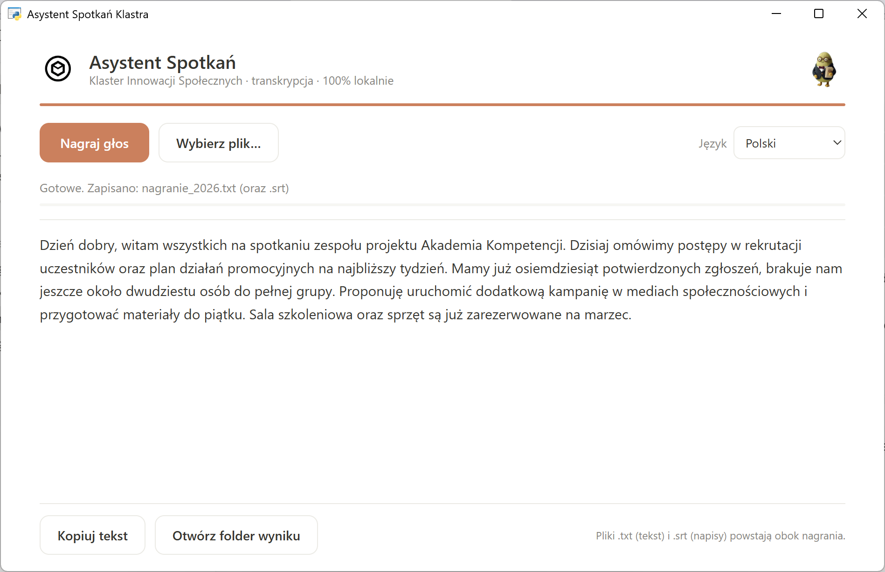

<div align="center">


# Asystent Spotkań Klastra

Zamień nagrania w tekst. Lokalnie, prywatnie, za darmo.


[Strona projektu](https://klaster1234.github.io/asystent-spotkan-klastra/) · [Pobierz](https://github.com/Klaster1234/asystent-spotkan-klastra/releases)



</div>

---

## Po polsku

Asystent Spotkań Klastra to lekka aplikacja dla Windows, która zamienia nagranie rozmowy w tekst (transkrypcja). Nagrywasz głos lub wczytujesz plik, a aplikacja zapisuje gotowy tekst (.txt) i napisy (.srt). Wszystko dzieje się na Twoim komputerze - żadne dane nie wychodzą do chmury, nie potrzeba konta ani internetu.

Lekka i dostępna dla każdego: działa na zwykłym komputerze, bez kart graficznych i bez dużych modeli AI.

### Funkcje

- Nagrywanie z mikrofonu jednym przyciskiem albo wczytanie pliku audio/wideo.
- Transkrypcja po polsku (oraz w innych językach) silnikiem whisper.cpp, model large-v3-turbo.
- Zapis tekstu (.txt) i napisów (.srt) obok nagrania.
- Nowoczesny, lekki interfejs (WebView2).
- Pełna prywatność - działa offline.

### Jak to działa

```
nagranie / plik  ->  Whisper  ->  tekst (.txt) + napisy (.srt)
```

## Wymagania sprzętowe

Aplikacja jest lekka i działa na typowym komputerze:

- Windows 10/11 64-bit
- Microsoft Edge WebView2 Runtime (zwykle już jest w Windows 11; instalator dograje go w razie potrzeby)
- Procesor 4-rdzeniowy lub lepszy
- 8 GB RAM
- Około 2 GB miejsca na dysku (silnik + model Whisper)
- Mikrofon - jeśli chcesz nagrywać (przy wczytywaniu plików niepotrzebny)

Karta graficzna nie jest wymagana - transkrypcja działa na procesorze.

## Instalacja (Windows)

### Najprościej: instalator (zalecane)

1. Pobierz **`AsystentSpotkanKlastra-Setup.exe`** ze strony [Releases](https://github.com/Klaster1234/asystent-spotkan-klastra/releases/latest).
2. Kliknij go dwukrotnie i przejdź przez kreator („Dalej" → „Zainstaluj").
3. Uruchom „Asystent Spotkań Klastra" z menu Start lub ikony na pulpicie.

Instalator **nie wymaga Pythona** ani żadnej wiedzy technicznej - zawiera wszystko (silnik Whisper i model) i działa offline. Potrzebny jest tylko Microsoft Edge WebView2 Runtime, który w Windows 11 jest już wbudowany (instalator dograje go w razie potrzeby).

### Dla programistów: uruchomienie z kodu źródłowego

1. Zainstaluj [Python 3.10+](https://www.python.org/downloads/) (zaznacz „Add to PATH").
2. Pobierz to repozytorium (Code → Download ZIP albo `git clone`).
3. W folderze projektu uruchom w PowerShell:
   ```powershell
   powershell -ExecutionPolicy Bypass -File install.ps1
   ```
   Skrypt dograje WebView2 (jeśli trzeba), pobierze silnik i model Whisper oraz utworzy skrót na pulpicie.

Model nie jest dołączony do repozytorium (jest duży i ma własną licencję) - pobiera go instalator. Sposób budowania pliku `Setup.exe` opisuje [installer/README.md](installer/README.md).

## Użycie

Kliknij ikonę „Asystent Spotkań Klastra" na pulpicie, a potem:

- „Nagraj głos" → mów → „Zatrzymaj i przepisz", albo
- „Wybierz plik…" i wskaż nagranie.

Tekst pojawi się w oknie i zapisze obok nagrania (.txt oraz .srt).

## Model i licencje

| Komponent | Licencja | Źródło |
|---|---|---|
| whisper.cpp | MIT | https://github.com/ggml-org/whisper.cpp |
| Whisper large-v3-turbo (GGML) | MIT | https://huggingface.co/ggerganov/whisper.cpp |

## Licencja

Kod: MIT (zobacz [LICENSE](LICENSE)). Logo Klastra i maskotka Klastus to znaki towarowe i nie są objęte licencją MIT - zobacz [NOTICE.md](NOTICE.md).

<div align="center">
<sub>Zbudowane dla Klaster Innowacji Społecznych · „Inicjatywy społeczne dla wszystkich"</sub>
</div>
